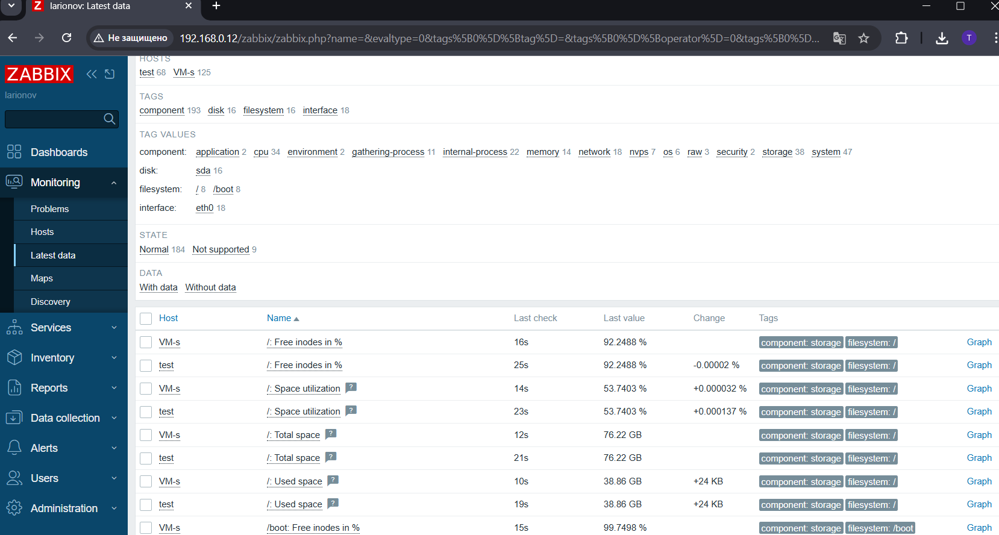

# Домашнее задание к занятию "Система мониторинга Zabbix"

**SMON-46 / Ларионов Сергей**
   
---

## Задание 1: Установка Zabbix Server

### Текст использованных команд:

```bash
# Установка PostgreSQL из репозитория Debian
sudo apt install postgresql

# Загрузка пакета с репозиторием Zabbix
wget https://repo.zabbix.com/zabbix/6.0/debian/pool/main/z/zabbix-release/zabbix-release_latest_6.0+debian11_all.deb

# Установка загруженного пакета репозитория
dpkg -i zabbix-release_latest_6.0+debian11_all.deb

# Обновление информации о пакетах
sudo apt update

# Проверка добавленных репозиториев Zabbix
ls -la /etc/apt/sources.list.d/

# Поиск доступной версии PHP для PostgreSQL (опционально)
sudo apt search php-pgsql

# Установка необходимых компонентов Zabbix
sudo apt install zabbix-server-pgsql zabbix-frontend-php php8.3-pgsql zabbix-apache-conf zabbix-sql-scripts

# Проверка статуса службы Zabbix Server
systemctl status zabbix-server.service

# Создание пользователя 'zabbix' в PostgreSQL
sudo -u postgres createuser --pwprompt zabbix

# Проверка создания пользователя
sudo -u postgres psql -c "\du zabbix"

# Создание базы данных 'zabbix' с владельцем 'zabbix'
sudo -u postgres createdb -O zabbix zabbix

# Проверка создания базы данных
sudo -u postgres psql -c "\l"

# Импорт начальной схемы данных в базу
zcat /usr/share/zabbix-sql-scripts/postgresql/server.sql.gz | sudo -u zabbix psql zabbix

# Просмотр параметров БД в конфигурационном файле
cat /etc/zabbix/zabbix_server.conf | grep DBP

# Настройка пароля для БД в конфигурационном файле (замена и раскомментирование строки)
sed -i 's/# DBPassword=/DBPassword=1/g' /etc/zabbix/zabbix_server.conf

# Проверка применения пароля
cat /etc/zabbix/zabbix_server.conf | grep DBP

# Перезапуск служб Zabbix Server и Apache
systemctl restart zabbix-server apache2

# Включение автозапуска служб
systemctl enable zabbix-server apache2

# Проверка статуса службы Zabbix Server после настройки
systemctl status zabbix-server.service
```


**Изображение 1:** Авторизация в админке Zabbix.


---

## Задание 2: Установка Zabbix Agent на два хоста

### Текст использованных команд:

```bash
# Установка пакета репозитория Zabbix (если не сделано ранее)
dpkg -i zabbix-release_latest_6.0+debian11_all.deb

# Обновление информации о пакетах
sudo apt update

# Установка Zabbix Agent
sudo apt install zabbix-agent

# Проверка статуса службы Zabbix Agent
systemctl status zabbix-agent.service

# Перезапуск служб сервера (на сервере Zabbix)
systemctl restart zabbix-server apache2

# Включение автозапуска служб (на сервере Zabbix)
systemctl enable zabbix-server apache2

# Перезапуск службы агента после настройки конфигурации
sudo systemctl restart zabbix-agent.service

# Просмотр логов Zabbix Server (для проверки подключений)
tail -f /var/log/zabbix-server/zabbix_server.log

# Просмотр логов Zabbix Agent (для проверки подключения к серверу)
tail -f /var/log/zabbix-agent/zabbix_agentd.log
```


**Изображение 2:** Скриншот раздела Hosts, где видно, что агенты подключены к серверу.

<br><br>


**Изображение 3:** Скриншот логов Zabbix Agent, где видно, что он работает с сервером.

<br><br>


**Изображение 4:** Скриншот раздела Latest Data для обоих хостов, где видны поступающие данные от агентов.


